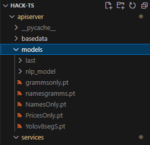

 # Кейс по разработке сервиса для Автоматизации сбора и анализа инфорамции об уровне цен на социально значимые товары в магазинах и торговых сетях Донецкой Народной Республики и их соответствии рекомендованным максимальным ценам


## Команда: TeamSpirit


**Мы предлагаем:**

- Полностью функционирующее мобильное приложение
- Полностью функционирующий веб-интерфейс 
- Сервер с полностью функционирующими нейросетями с высокой точностью  и скоростью обработки запроса
- Функционал для отправки сообщений на почту

**Основной функционал:**

- Возможность регистрации 
- Возможность загрузить фотографию
- Обработка фотографии проходит на сервере. Обработанная информация идёт на веб-сервис и если нужно - на почту
- Возможность посмотреть все прихолдящие запросы, также наличие метки "Требующий решения" и наличие кнопки "Завершить запрос".

**Краткое описание**: 

Мобильное приложение. В приложении пользователь может сделать или загрузить фотографию ценника, чтобы отправить её для дальнейшей обработки. В приложении есть реальные адреса магазинов и регистрация. После того, как человек отправил фотографию ему возвращается ответ с сервера о том, передан ли запрос в администрацию.


Сервер. На сервере у нас обрабатываются все входящие запросы и передаются в веб-интерфейс для правительства и органов муниципалитета. На сервере работают одновременно 6 нейросетей, которые с высокой точностью обрабатывают запрос клиента.

Веб-интерфейс. Предназначен для органов власти, в нём можно увидеть таблицу по всем пришедшим запросам, также, можно будет увидеть, является ли цена из запроса нормальной. Если же цена будет выше рекомендуемой, запрос будет выделен как "Требующий решения", который можно будет закрыть. 

<!--  -->


Клиенту предлагается выбрать адрес магазина, загрузить фотографию, сделать для неё описание и по нажатию кнопки выслать фотографию на сервер для обработки. После обработки в мобильное приложение придёт ответ, относится ли этот продукт к меморандому и принят ли запрос в обработку. Если продукт не относится к меморандому, то об этом придёт уведомление.


На сервере происходит обработка фотографии несколькими моделями, для поиска bounding box используются модели yolov8s, для распознавания текста внутри bounding box используется easyOCR, а для классификации по категориям Bert. 

Весь процесс занимает от 4 до 7 секунд, вместе с отправкой и загрузкой фотографии. 


 

Перейдем к веб-интерфейсу. Мы можем заметить две вкладки: Запрос и История. Во вкладке запрос находятся все запросы, которые пришли на рассмотрение Администратора. Там же на каждой карточке с запросом можно увидеть кнопку "Подтвердить", которая эмулирует работу органов власти по контролю цен в магазинах. После её нажатия запрос перейдёт во вкладку История, где можно посмотреть все запросы, которые когда либо были.

 

Используемый стэк технологий: Python, Kotlin, HTML/JavaScript/CSS , TensorFlow, Pytorch, SQLite, UltraLytics


**Для тестерования приложения на андройд-устройстве достаточно просто установить apk файл и запустить приложение**
Если вы хотите протестировать наш сервис в работе, то вам нужно скачать веса моделей по следующей [ссылке](https://disk.yandex.ru/d/c8p3hr18ZrOWaQ)

Поместить веса нужно внутрь папки apiserver вот таким образом:



Далее в корневном каталоге проекта нужно прописать команду для запуска сервера fastapi:

```
    uvicorn apiserver.api_server:app --reload
```

После этого переходим в каталог cd .\djangoweb\ и запускаем веб приложение:

```
    python manage.py runserver 8080
```


## Пример тела запроса для работы серверной части приложения:


```json
{
    "photo_url": "https://firebasestorage.googleapis.com/v0/b/hakaton-7c7d7.appspot.com/o/images%2FIMG_5835.jpg?alt=media&token=6185aa4d-5842-49b4-975a-c83ec1e8c829",
    "area": "Амвросиевка",
    "district": "ул Федотова 52",
    "description": "description"
}
```

## Точка доступа

1. http://127.0.0.1:8000/predict - на нее отправляем POST запрос с шаблоном выше

## Проверка

Далее можем зайти по адресу http://127.0.0.1:8080 и попасть на веб-интерфейс приложения и увидеть все ваши запросы и обращения к базе данных

## Полный функционал нашего сервиса

Если вы хотите использовать не только наше api и веб-сервис, а также протестировать мобильное приложение, то вы можете либо клонировать репозиторий
```
    git clone https://github.com/seyveR/ts-mobile-hack.git
```

Запустить проект и отправить парочку запросов через мобильный интерфейс эмулятора

Или вы можете скачать наш [apk файл](https://disk.yandex.ru/d/c8p3hr18ZrOWaQ) к себе на android устройство и отправить запрос со своего телефона